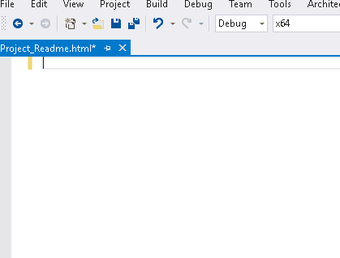
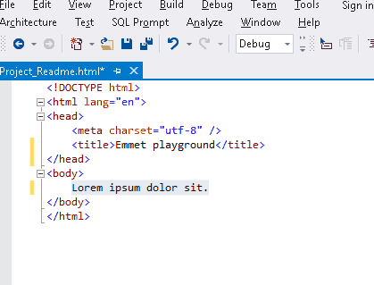
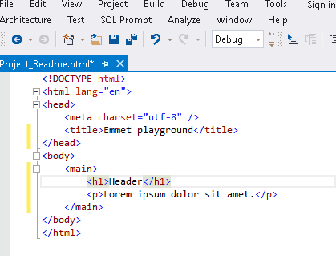
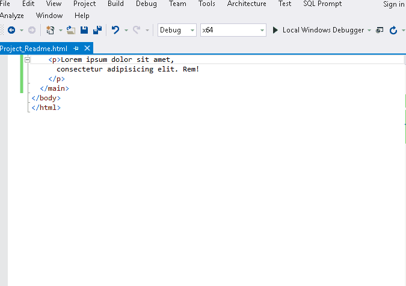
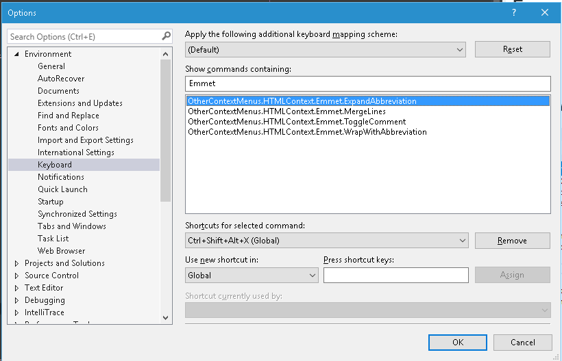

# Emmet.net - Emmet for Microsoft Visual Studio

This project is a MS Visual Studio port of Emmet editor extensions created by Sergey Chikuyonok.

More information on the oriignal project is available on [Emmet official website](http://docs.emmet.io/).

## Download

Precompiled version can be downloaded from [VSIX Gallery](http://vsixgallery.com/extension/Emmet.net.Sergey%20Rybalkin.9a011f0e-c870-4faa-aaee-536a8040385c/). Simply install downloaded VSIX package and you are good to go.

[Version History](docs/changelog.md)

## Features

Below is the list of actions that are currently implemented in this extension. The rest of them are either natively supported by Visual Studio or exist in either ReSharper or WebEssentials extensions and therefore were not included.

### Expand Abbreviation (Ctrl+Shift+Alt+X)

Supported in HTML and CSS-like syntaxes (Razor views, LESS, SCSS).

[Details](http://docs.emmet.io/actions/expand-abbreviation/)

### Wrap with Abbreviation (Shift+Alt+W)

[Details](http://docs.emmet.io/actions/wrap-with-abbreviation/)

### Toggle Comment (Ctrl+Alt+Num /) 

[Details](http://docs.emmet.io/actions/toggle-comment/)

### Merge Lines (Ctrl+Alt+Shift+M) 

[Details](http://docs.emmet.io/actions/merge-lines/)

### Configuration and Extensions

Configuration settings are available under Tools -> Options -> Emmet section.

Default keyboard shortcuts configuration:

Emmet.net supports loading custom JavaScript-based preferences, snippets and extensions directly into Emmet engine. All you need is to specify extensions directory in the Emmet configuration section on the Tools -> Options page. Detailed information about writing Emmet extensions and snippets is available [here](http://docs.emmet.io/customization).

### C# mnemonics expansion (experimental)

Mnemonics are advanced dynamic snippets for C# language that let you quickly generate fields, properties and methods by typing a short abbreviation that defines its accessibility level, return value and other attributes. This implementation is inspired by popular ReSharper extensions [ZenSharp](https://github.com/ulex/ZenSharp) and [Live Templates](https://resharper-plugins.jetbrains.com/packages/JetBrains.Mnemonics/).

Mnemonic snippet has the following structure: `<accessibility level><modifiers><return value><member type>`.

Accessibility levels:

| shortcut | expands to         |
|----------|--------------------|
| _        | private            |
| p        | public             |
| P        | protected          |
| i        | internal           |
| pi       | protected internal |

Modifiers:

| shortcut | expands to         |
|----------|--------------------|
| c        | const              |
| s        | static             |
| v        | virtual            |
| a        | abstract           |
| r        | readonly           |

Return values:

| shortcut | expands to |
|----------|------------|
| s        | string     |
| sh       | short      |
| by       | byte       |
| b        | bool       |
| dt       | DateTime   |
| d        | double     |
| i        | int        |
| u        | uint       |
| g        | Guid       |
| de       | decimal    |
| v        | void       |

Member types:

| shortcut | expands to |
|----------|------------|
| p        | property   |
| m        | method     |
| f        | field      |

For example, mnemonic `_rif` will generate new private field `private readonly int |`.

## Build

Emmet is originally written in JavaScript and Visual Studio cannot run it natively, so this project is using [V8.NET JavaScript engine](https://v8dotnet.codeplex.com/) to execute Emmet code. V8.NET libraries are included with source code and other dependencies are managed with NuGet.

Visual Studio 2015 Update 3 and Visual Studio SDK are required to build the project.